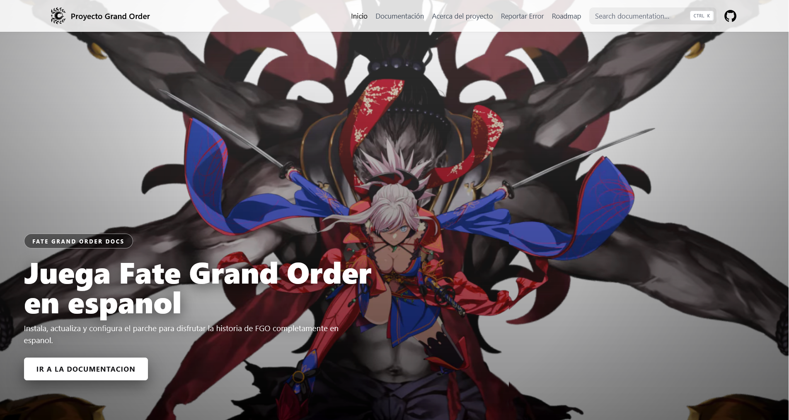

# Proyecto Grand Order Docs

Documentacion oficial del proyecto para instalar, actualizar y solucionar problemas de Rayshift Translate en Fate/Grand Order.

- Sitio: https://proyectograndorder.es
- Stack: Next.js 14 + Nextra + Tailwind CSS
- Licencia: ISC

## Requisitos

- Node.js 18 o superior
- pnpm habilitado

Si `pnpm` no se reconoce en tu sistema:

```sh
corepack enable
```

## Instalacion

```sh
pnpm install
```

## Desarrollo local

```sh
pnpm dev
```

Abre `http://localhost:3000`.

## Scripts disponibles

- `pnpm dev`: inicia el servidor de desarrollo.
- `pnpm build:site`: genera el build de Next.js.
- `pnpm build:sitemaps`: genera sitemaps con `next-sitemap`.
- `pnpm build`: ejecuta build de sitio + sitemaps.
- `pnpm start`: levanta el sitio en modo produccion.

## Busqueda (modo hibrido)

El sitio ahora usa una busqueda hibrida:

- Sin variables de entorno: usa la busqueda local de Nextra (fallback).
- Con credenciales de Algolia: usa DocSearch (UX similar a Starlight).

Variables opcionales para activar Algolia:

- `NEXT_PUBLIC_ALGOLIA_APP_ID`
- `NEXT_PUBLIC_ALGOLIA_API_KEY`
- `NEXT_PUBLIC_ALGOLIA_INDEX_NAME`

Para solicitar DocSearch gratis (sitios de documentacion OSS):

- https://docsearch.algolia.com/apply/

Cuando Algolia aprueba tu dominio, agrega esas variables y reinicia `pnpm dev`.

## Estructura principal

- `pages/`: contenido de documentacion en MDX.
- `components/`: componentes reutilizables del sitio.
- `public/`: assets estaticos (imagenes, favicon, sitemap, etc.).
- `styles/`: estilos globales.
- `utils/`: utilidades internas.

## Contribuir

1. Haz un fork del repositorio.
2. Crea una rama con tu cambio.
3. Realiza tus modificaciones y prueba en local.
4. Abre un Pull Request con una descripcion clara.

## Autor

- GitHub: [@O-Isaac](https://github.com/O-Isaac)

## Apoyo

Si te resulta util este proyecto, puedes apoyarlo con una estrella en GitHub.
